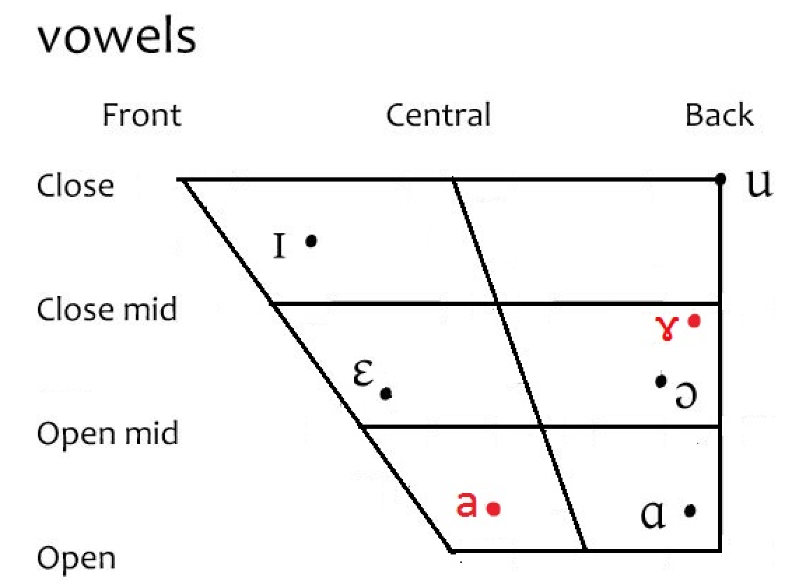
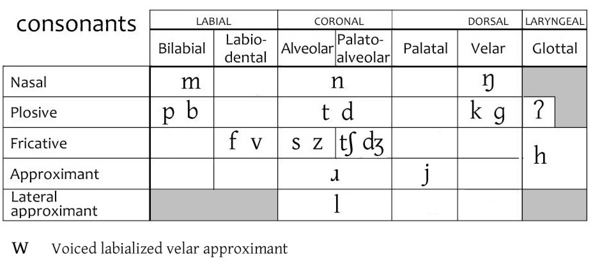

# Phonology 

### Vowels:

This language has only five vowels: / ɑ /, / ɛ/, / ɪ /, / o /, / u /.

1. / ɪ / only comes after / kʰ /, / pʰ /, / tʰ/, / n /, / ŋ /.

2. [ ɤ ] is the variant  of / ɛ / when it comes before / ŋ /.

3. [ a ] is the variant  of / ɑ / when it comes after / j / .

### Consonants:

1. Fortis-lenis pairs:

These pairs of consonants distinguish themselves by whether they are aspired or not instead of whether they are voiced or not.

/p/ = [ pʰ ] or [ bʰ ]            /b/ = [ p ] or [ b ]

/t/ = [ tʰ ] or [ dʰ ]              /d / = [ t ] or [ d ]

/k/ = [ kʰ ] or [ gʰ ]            /g/ = [ k ] or [ g ]

2. / z / /m/ /b/ almost happen in the non-stressed syllables.

3. The germination will almost happen when / s / is in the stressed syllable.

This language does not have a writing system. Here we spell it by Latin characters.

Orthography

a = / ɑ /

e = / ɛ /

i = / ɪ /

o = / o /

u = / u /

p = / p / 

b =  / b /

t = / t / 

d = / d /

k = / k /

g = / g /

m = / m /

n = / n /

ng = / ŋ /

f = / f /

v = / v /

s = / s /

z = / z /

y = / j /

ch= / t͡ʃ /

c = / d͡ʒ /

l = / l /

h = / h /

r = /ɹ/

w = / w /

pp = / p: / 

bb = / b: /

tt = / t: /

dd = / d: /

kk = / k: /

gg =  / g: /

mm = / m: /

nn = / n: /

nng = / ŋ: /

ff = / f: /

vv = / v: /

ss = / s: /

zz = / z: /

yy = / j: /

cch= / t͡ʃ: /

cc = / d͡ʒ: /

ll = / l: /

All rights reserved 
