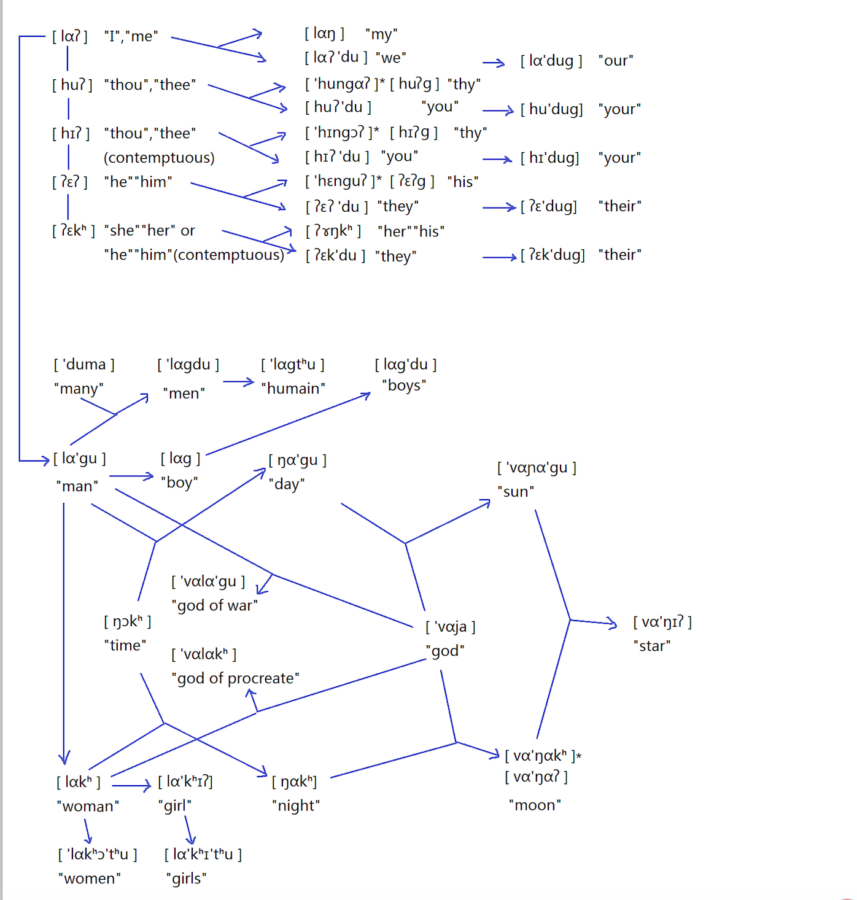

this Table displays the ethnolinguistics-oriented morphology.

the sign * represents the old-fashioned manner of pronunciation.


 

I spent about 5 evenings (ca. 15 hours) creating these special examples to demonstrate my capability of creating a language although it might be a little sketchy.

The people who use this language are some savage nomadic tribes. They are fierce, aggressive and extremely masculine. There are often combats among different  tribes.

This language is constructed based on my theory of « phonetic aesthetics » whose phonemes have high sonority. It is relatively rhythmic and it transmits a savage and wild sensation.

Because this people is extremely chauvinistic and patriarchal, we can see that <lagu> « man » derives from <la> »I » which means « someone like me ».

Likewise, they use female personal pronouns such as « you (feminine) » and « she » to show their contempt and insult. In the case of their defeated enemies, for example.

The day is the time for men’s fighting and the night belongs to the women. Therefore, <ngagu> »Men’s Time » signifies the day and <ngak*> »Women’s Time » signifies the night.

They regard the sun and the moon as gods so they call them <vangagu> « the god of day » and <vangak*> »the god of night » respectively.

```
© 2011-2020 guenchi.  All rights reserved.
```
